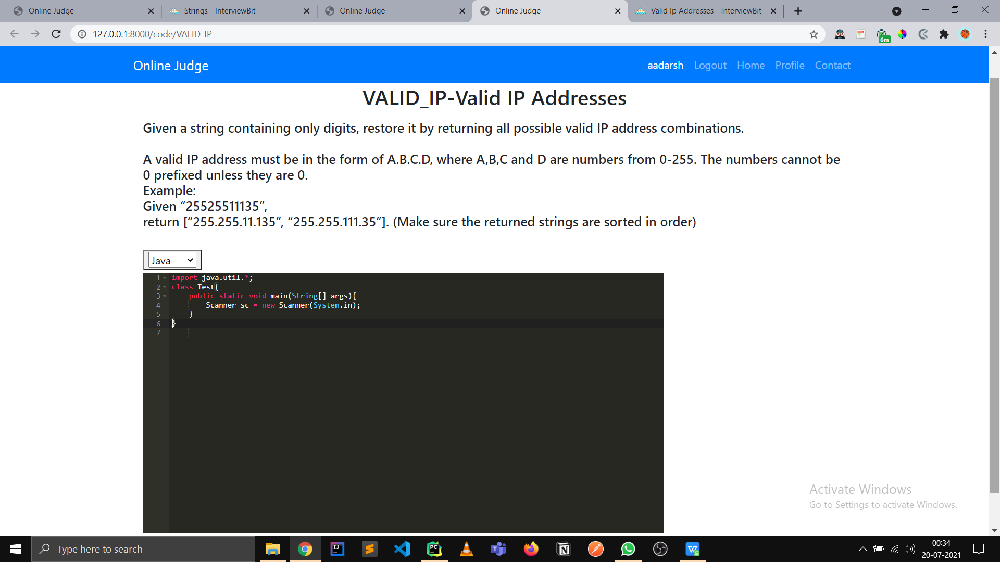
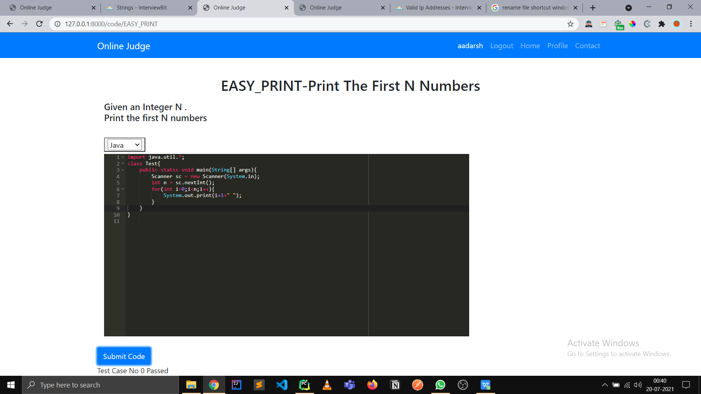
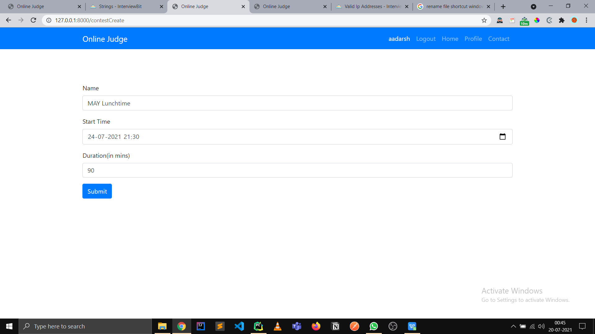

Online Judge

An online judge made in django.

Inbuilt ace editor API that enables syntax highlighting for supported
languages

Submit Your code to see how many test cases you passed

Supported Languages => JAVA, C++, PYTHON  
Make your own Problemsets that you can later revise.   
Create your own contests Invite your friends to join.

